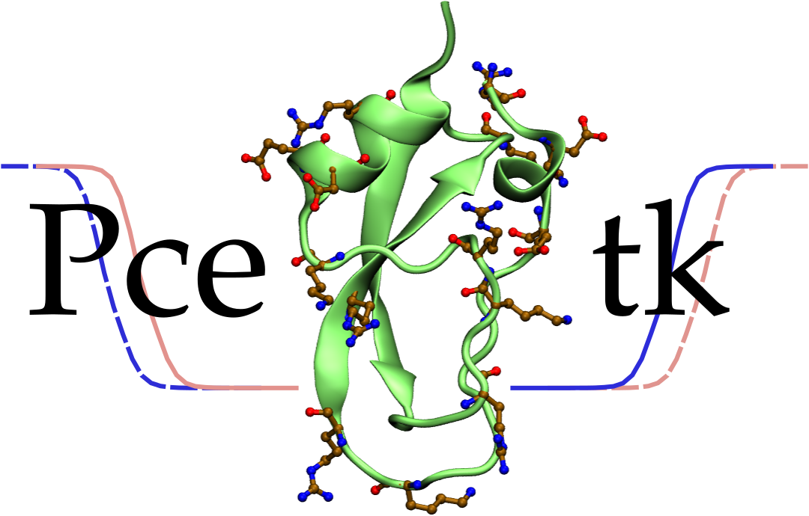

Pcetk (a pDynamo-based continuum electrostatic toolkit) is a Python module
extending the [pDynamo](https://sites.google.com/site/pdynamomodeling) library 
with a microstate model for the calculation of proton binding energetics in proteins.

The module links pDynamo to the external solver of the Poisson-Boltzmann
equation, 
[extended-MEAD](http://www.bisb.uni-bayreuth.de/People/ullmannt/index.php?name=extended-mead), 
which is used for the calculation of electrostatic energy terms. 
The calculation of protonation states and titration curves is done with 
custom analytic or Monte Carlo routines or, optionally, through an interface 
to the external sampling program, 
[GMCT](http://www.bisb.uni-bayreuth.de/People/ullmannt/index.php?name=gmct-gcem).

Author: Mikolaj Feliks \<<mikolaj.feliks@gmail.com>\>

Released under the CeCILL Free Software License, a French equivalent of the GNU General 
Public License. More information can be found in [Licence_CeCILL_V2-en.txt](Licence_CeCILL_V2-en.txt) 
or [Licence_CeCILL_V2-fr.txt](Licence_CeCILL_V2-fr.txt) (in French).

## Key features of Pcetk
  - Extensible framework for studying protein titration
  - User interface is a Python script
  - Close integration with pDynamo
  - Computationally intensive parts of code implemented in C/Cython
  - Improved treatment of polyprotic sites: histidines or polyprotic ligands
  - Analytic calculation of protonation states (for small proteins)
  - Custom Metropolis Monte Carlo sampling algorithm (for large proteins)
  - Calculations of substate energies
  - Automatic generation of titration curves
  - Parallel calculation of electrostatic energy terms with MEAD
  
## Citation
If you use Pcetk in your work, please cite:
> Mikolaj Feliks \& Martin Field, ["*Pcetk*: A pDynamo-based Toolkit for Protonation State Calculations in Proteins."](http://dx.doi.org/10.1021/acs.jcim.5b00262), *J. Chem. Inf. Model.* **2015**, *55*, 2288-2296

**Bibtex**
```
@article{ Feliks2015,
author  = {Feliks, Mikolaj and Field, Martin},
title   = "{{Pcetk}: A pDynamo-based Toolkit for Protonation State Calculations in Proteins}",
journal = {J. Chem. Inf. Model.},
year    = {2015},
volume  = {55},
pages   = {2288-2296},
url     = {http://dx.doi.org/10.1021/acs.jcim.5b00262},
}
```

## Installation instructions
Required software and libraries:
 - [pDynamo 1.8.0](https://sites.google.com/site/pdynamomodeling)
 - [Extended-MEAD 2.3.0](http://www.bisb.uni-bayreuth.de/People/ullmannt/index.php?name=extended-mead)
 - Python 2.7 (including header files; python2.7-dev package in Debian)
 - PyYAML 3.10 (python-yaml package in Debian)
 - GNU toolchain (GCC, make)
 
 Optionally:
 - Cython 0.15.1 (for recompiling Cython sources)
 - [GMCT 1.2.3](http://www.bisb.uni-bayreuth.de/People/ullmannt/index.php?name=gmct-gcem)

For proper functioning, Pcetk requires two programs from the Extended-MEAD package, namely 
my_2diel_solver and my_3diel_solver. Download Extended-MEAD and follow its installation 
instructions. In the future, the toolkit may switch to a custom Poisson-Boltzmann solver.

In the next step, clone the newest repository of Pcetk from GitHub:
```
$ git clone https://github.com/mfx9/pcetk.git
```

Some modules are written in C/Cython and have to be compiled before they can be used. 
These modules include StateVector, EnergyModel and MCModelDefault.

Go to extensions/cython and edit the first line of Makefile. The PDYNAMO\_CORE variable 
should point to the location of pDynamo. After editing the file, run make install.
```
$ cd extensions/cython
$ vi Makefile
  (... now edit the file ...)
$ make install
```

See the [manual](doc/Pcetk_manual.pdf) for more details.

At this point, the installation is complete. Before Pcetk can be used, set or update 
the PDYNAMO_PCETK and PYTHONPATH variables:
```
$ export PDYNAMO_PCETK=/home/mikolaj/devel/pcetk
$ export PYTHONPATH=${PDYNAMO_PCETK}:${PYTHONPATH}
```

## Manual
Please, see the [manual](doc/Pcetk_manual.pdf) for detailed instructions and examples of use.

## Auxiliary software
Extended-MEAD was written by Donald Bashford and extended by Timm Essigke and Thomas R. Ullmann.
GMCT was written by Matthias G. Ullmann and Thomas R. Ullmann.
pDynamo was written by Martin Field and collaborators.
